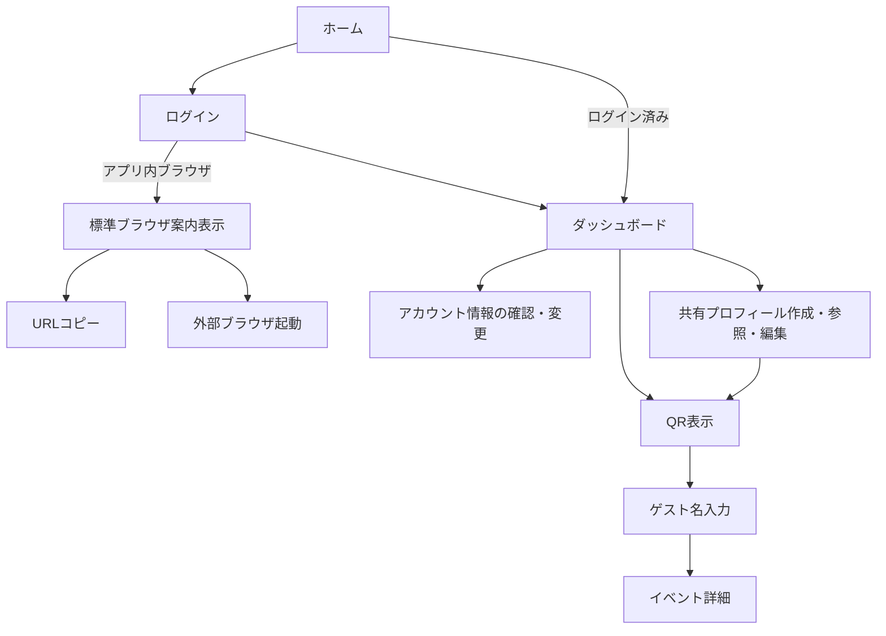
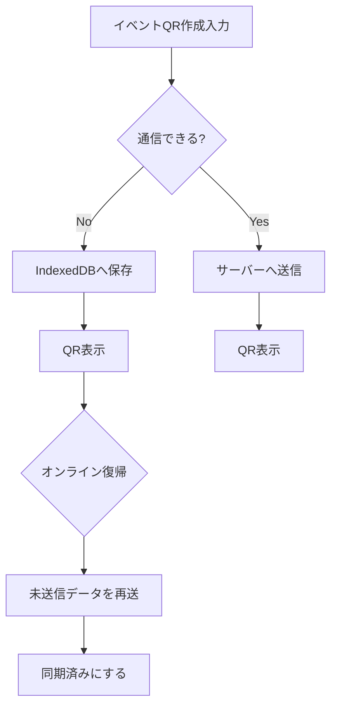

# 1G1A Site Map and Screen Structure

このドキュメントは、1G1A の画面構成、主要導線、各画面の表示項目を整理するための設計メモです。
公開リポジトリに置く前提のため、サーバー固有のホスト名、IP、実ディレクトリ、秘密情報は記載しません。

## 前提

- 現在の実装は PHP + HTML + CSS + JavaScript のフレームワークなし構成。
- ログイン画面とログイン後のユーザー画面は、すべてPWAとして構成する。
- QR表示画面は、共有イベント作成直後だけでなくイベント一覧から再表示する場合もPWA内で扱う。
- ユーザーは、共有イベントが未アップロードでもPWA内の端末保存データからイベント内容を確認できる。
- ゲスト公開ページはPWAとしてインストールさせる対象にはしない。QRから通常のWebページとして閲覧し、利用時は完全オンライン前提とする。
- 共有イベントがまだサーバーへアップロードされていない場合、ゲスト公開ページではイベント詳細を表示できないため準備中ページを表示する。

## サイトマップ

### 画面構成

1G1A の画面は「公開・認証前」「ログイン後」「ゲスト公開」の3系統で構成する。

公開・認証前は、サービス入口、ログイン、認証処理、ログアウト、ヘルスチェックで構成する。

ログイン後は、ダッシュボード、アカウント情報の確認・変更、共有プロフィール作成・参照・編集、QR表示で構成し、すべてPWA内の画面として扱う。
共有プロフィールは、作成・参照・編集を別々の体験に分けず、同じ画面内で状態を切り替えて扱う。

ゲスト公開は、QRからアクセスしたゲストが、ログインなしで共有イベントを閲覧する画面として構成する。
ゲスト公開はPWA登録対象外とする。
ゲスト公開は完全オンライン前提とし、端末内保存やオフライン再送は行わない。
ゲスト側のCookieや保存状態は、共有イベントごとに分離する。

### 公開・認証前

| URL | 画面名 | 役割 |
| --- | --- | --- |
| `/` | ホーム | サービス入口。未ログインユーザー向けの概要表示。ログイン済みユーザーはダッシュボードへ遷移する。 |
| `/login` | ログイン | Google ログインの入口。アプリ内ブラウザなどGoogle認証が失敗しやすい環境では、標準ブラウザで開く案内を表示する。 |
| `/auth/google` | Google認証開始 | Google OAuth へ遷移する処理。画面ではなく認証処理。 |
| `/auth/google/callback` | Google認証戻り | Google OAuth の戻り処理。画面ではなく認証処理。 |
| `/logout` | ログアウト | セッションを破棄してホームへ戻す処理。 |
| `/healthz` | ヘルスチェック | サーバー稼働確認用。 |

### ログイン後

| URL | 画面名 | 役割 |
| --- | --- | --- |
| `/dashboard` | ダッシュボード | 共有プロフィール選択、イベントQR作成、最近の共有イベント確認の中心画面。 |
| `/account` | アカウント情報の確認・変更 | ユーザー自身のアカウントプロフィール画像、名称、Google認証情報を確認・変更する画面。 |
| `/profiles` | 共有プロフィール作成・参照・編集 | 相手に見せる共有プロフィールを一覧、作成、確認、編集する画面。 |
| `/profiles/{id}` | 共有プロフィール作成・参照・編集 | 既存の共有プロフィールを同じ画面内で確認・編集する画面。 |
| `/profiles/{id}/qr` | QR表示 | 共有イベント用QRの表示・再表示を行うPWA内画面。イベント詳細は表示しない。 |

### ゲスト公開

| URL | 画面名 | 役割 |
| --- | --- | --- |
| `/s/{share_event_token}` | 共有イベント公開ページ | QRを読んだゲストが見る画面。ゲスト名入力画面とイベント詳細画面の2画面で構成する。 |
| `/media/{filename}` | メディア配信 | アップロード済み画像を返す。画面ではなく画像配信処理。 |

### 非同期処理・API

| URL | 用途 | 呼び出し元 |
| --- | --- | --- |
| `POST /share-tokens/reserve` | オフラインQR用の共有トークンを事前予約する。 | ダッシュボードのJavaScript。 |
| `POST /share-events/create` | 共有イベントを作成する。JSON応答にも対応。 | ダッシュボード、同期キュー。 |
| `POST /share-events/{id}/location` | QR表示時に取得できた位置情報を保存する。 | QR表示画面のJavaScript。 |

## 画面構成

### ホーム

目的:
サービスの入口。ログイン前のユーザーに、1G1A が「相手に見せるプロフィールとその場のメッセージをQRで渡すサービス」であることを伝える。
ログイン済みユーザーがアクセスした場合は、ホームを表示せずダッシュボードへ遷移する。

表示項目:

- サービス名
- サービス概要
- ログイン導線

主な操作:

- ログイン画面へ進む

遷移:

- 未ログインの場合はホームを表示する
- ログイン済みの場合は `/dashboard` へ遷移する

### ログイン

目的:
Googleアカウントでログインする。
この画面はPWAの入口として扱う。
LINEなどのアプリ内ブラウザや、Google OAuth が失敗しやすいブラウザで開かれた場合は、Googleログインを直接開始させず、標準ブラウザで開くための案内を表示する。

表示項目:

- Googleログインボタン
- ログインできない場合の案内

アプリ内ブラウザ判定時の表示項目:

- 標準ブラウザで開く必要があることの案内
- 現在のURLをコピーするボタン
- Android向けの外部ブラウザ起動用リンク
- iPhone向けの、LINEなどのメニューから「ブラウザで開く」操作を促す案内

主な操作:

- Google OAuth 開始
- 現在のURLをコピーする
- Androidで外部ブラウザ起動用リンクを開く

注意:

- メールアドレスやGoogle IDはゲスト画面には出さない。
- アプリ内ブラウザ判定時は、Googleログインボタンをそのまま表示しない。
- iPhoneではWebページ側からSafariなどの標準ブラウザへ確実に自動遷移させることはできないため、手順案内を基本にする。
- Androidの外部ブラウザ起動用リンクは、端末やアプリの制限により動作しない場合があるため、URLコピー手段も必ず用意する。
- 共有イベント公開ページはログイン不要のため、アプリ内ブラウザでも閲覧を止めない。

### ダッシュボード

目的:
ログイン後の中心画面。会った相手に見せるプロフィールを選び、その場のメッセージや写真を付けてQRを作る。
この画面はPWA内の中心画面として扱う。

表示項目:
表示順はここで出てきた順を基本とする

- ヘッダ
　- アカウントプロフィールアイコン
    - クリックするとアカウント情報の確認・変更画面を開く
  - ログアウト導線
  - PWAインストール導線
    - (PWA)インストール後は非表示

- 共有ブロック
  - 共有プロフィール選択
  - 共有メッセージ
  - 共有写真追加
    - カメラ起動、アルバム選択
  - 共有QRの有効期限選択
  - 共有人数選択
  - 共有QR作成ボタン

- 共有プロフィール一覧ブロック

- 最近の共有イベント一覧ブロック
  - ページング有効　５件づつ表示
  - クリックすると共有イベント用のQRコード画面を開く
  - その後ユーザ自身がurlから入った場合は名前を聴いてこないようにすぅる

主な操作:

- 共有イベントを作成する
- 通信できない場合はIndexedDBに未送信データとして一時保存する
- 通信復帰後に未送信データをサーバーへ送る
- 共有プロフィール作成・参照・編集画面へ移動する
- 新しい共有プロフィールを作成する

PWA化で強化する項目:

- 未送信件数の表示
- 同期待ち一覧
- 手動再送ボタン
- 同期失敗理由の表示
- 端末内だけに残っている未送信データの削除

### アカウント情報の確認・変更

目的:
ユーザーアカウントにひもづく基本情報を確認・変更する。ヘッダのアカウントプロフィールアイコンから開く。
アルファ版では、課金や長期的なアカウント引き継ぎに使う固有ID連携は行わない。

表示項目:

- アカウントプロフィール画像
  - 未登録の場合はデフォルトの画像を用意しておいてそれを使う
  - 10種類ぐらい作って初回登録でランダムにする
- アカウントの名称
- Google認証情報
  - メールアドレス
- 保存ボタン
- 公開されない情報の説明

主な操作:

- アカウントプロフィール画像を設定する
- アカウントの名称を保存する

変更できない項目:

- Google認証情報
- メールアドレス

注意:

- アカウントプロフィール画像は、ユーザーアカウントに紐づく画像として扱う。
- アカウントプロフィール画像が未登録の場合は、初回登録時にデフォルト画像候補からランダムに1つを割り当てる。
- Google認証情報は確認用に表示するが、この画面では変更できない。
- メールアドレスやGoogle IDはゲスト画面には出さない。
- アルファ版では、アカウントを使い捨てても成立する前提にする。
- 課金や長期利用を扱う段階で、サービス側の固有IDや外部認証との連携設計を追加する。

### 共有プロフィール作成・参照・編集

目的:
相手に見せるプロフィールを用途別に作り、内容確認と編集までを同じ画面で扱う。仕事用、趣味用、イベント用などを分けられるようにする。

表示項目:

- 管理用プロフィール名
- 表示名
- プロフィール画像
  - 共有プロフィール画像が未設定の場合は、アカウントプロフィール画像を表示する
  - 共有プロフィール画像を削除した場合も、アカウントプロフィール画像を表示する
- 見出し
- 自己紹介
- 利用状態
- SNS/外部リンク一覧
- SNS種別
- リンクラベル
- URL
- 最近の共有イベント
- イベント写真
- 保存ボタン

主な操作:

- 共有プロフィールを作成する
- 共有プロフィールを参照する
- 共有プロフィールを更新する
- プロフィール画像をアップロードする
- SNS/外部リンクを登録・更新する
- 利用状態を切り替える
- QR表示へ進む

注意:

- プロフィール画像はURL手入力ではなく、端末からのアップロードを基本にする。
  - カメラ起動またはアルバムから選択できるようにする
  - 初回追加時や削除したときはアカウントプロフィール画像を表示する
- 共有プロフィール画像が未設定の場合に表示するアカウントプロフィール画像は、あくまで表示上のフォールバックとして扱う。
- 共有プロフィール画面でプロフィール画像を削除しても、共有プロフィールに設定された画像だけを削除し、元のアカウントプロフィール画像は削除しない。
- 共有イベント画面やQR中央に表示する画像も、共有プロフィール画像があればそれを使い、なければアカウントプロフィール画像を使う。
- 共有プロフィール単体の公開URLは持たせない。
- ゲストは共有イベントURLからのみ、共有イベントに紐づくプロフィール情報を見る。
- 作成、参照、編集は別ページに分けず、一覧選択や編集モード切り替えで一画面にまとめる。

### QR表示

目的:
相手に見せるQRを大きく表示する。通信が不安定でも、相手が画面を写真に撮って後からアクセスできるようにする。
この画面はPWA内の画面として扱う。
再表示させることもあるため、ユーザーのイベント一覧をクリックしても表示できるようにする。
この画面では共有イベントの本文、写真、状態などの詳細情報は表示しない。
イベント詳細の表示は、QR遷移後のゲスト公開ページで行う。

表示項目:

- 共有プロフィール名
- QRコード
  - QRコードの中心には、共有プロフィール画像があればそれを表示する
  - 共有プロフィール画像が未設定の場合は、アカウントプロフィール画像を表示する
  - アカウントプロフィール画像は初回登録時にデフォルト画像候補からランダムに1つ割り当てるため、QR中央には原則としてアカウント側の画像を表示する
- 短い説明文
- 英語の補助説明
- URL

主な操作:

- 位置情報の取得許可を求める
- 取得できた位置情報を保存する
- QRを相手に見せる
- URLを開く

注意:

- 位置情報取得に失敗してもQR表示は止めない。
- QRは通信復帰を待たずに表示できることを優先する。
- 共有イベントがまだサーバーへアップロードされていない場合でも、予約済みトークンがあればQRは表示できる。
- QR表示画面では共有イベントの本文、写真、状態などの詳細情報は表示しない。
- 未アップロードの共有イベントURLへゲストがアクセスした場合は、イベント詳細ではなく準備中ページを表示する。

### 共有イベント公開ページ

目的:
QRを読んだゲストが、共有イベントの内容を見る。
ゲスト公開は共有イベントからのみ行い、共有プロフィール単体やアカウントプロフィール単体の公開ページは作らない。
ゲスト公開ページは完全オンライン前提で動作し、オフライン保存や後送信は行わない。

画面構成:

- ゲスト名入力画面
- イベント詳細画面

ゲスト名入力画面の表示項目:

- 相手の表示名
- ニックネーム入力欄
- 次へボタン

イベント詳細画面の表示項目:

- イベント情報ブロック
  - ゲストへの歓迎表示
  - イベントメッセージ
  - イベント写真
    - 写真クリックで等倍化　その後は各自が勝手にブラウザの機能で保存
      - 直接URLをリンクできないようにする（リファラとか？）
  - 地図ブロック
    - 位置情報があったときのみ表示
    - 画面内には現在位置を確認できる埋め込み地図を表示する
    - 地図中央にピンを表示する
    - 「地図アプリで開く」導線を表示し、詳細な経路案内は外部の地図アプリに任せる
    - アルファ版では無料で使いやすい OpenStreetMap + Leaflet を候補にする
    - 地図タイルの読み込みはオンライン前提とする
    - OpenStreetMap の著作権表記を地図内または近接位置に表示する
    - 地図内の地名表示はOSやブラウザの言語ではなく、利用する地図タイル側の表記に依存する
    - 1G1A側の見出し、ボタン、補足文は日本語で表示する

- プロフィールブロック
  - プロフィール画像
  - 表示名
  - 見出し
  - 自己紹介
  - プイロフィールSNSブロック
    - SNS/外部リンク

- コミュニケーションブロック
  - ひとことメッセージ入力欄
  - 送信ボタン
  - ゲスト自身がメッセージを送っていたら、送信日時とメッセージ内容をリスト化
    - ゲストは他のゲストのメッセージを見れないようにする
  - ログイン済みユーザー本人が自分の共有イベント画面を表示した場合は、全ゲストのメッセージ履歴をリスト化する

- フッタ
  - サービス導線

主な操作:

- ゲスト名を登録する
- イベント内容を見る
- SNS/外部リンクを開く
- ひとことメッセージを送る

注意:

- ゲストにログインは求めない。
- ゲスト名は相手を厳密に特定する情報ではなく、閲覧体験を軽くするための表示名として扱う。
- ゲスト名や閲覧状態は、ユーザー単位ではなく共有イベント単位で保存する。
- 別の `share_event_token` から入った場合は、同じブラウザでも別のCookieまたはCookie内の別キーとして扱う。
- ゲスト側の保存キーには、入口を識別できる `share_event_token` またはそれに対応する共有イベントIDを含める。
- ゲストのひとことメッセージ送信はオンライン時のみ行う。
- ゲスト用のコミュニケーションブロックはゲスト画面専用とし、ユーザー側PWAのイベント内容確認画面には表示しない。
- 期限切れの共有イベントは期限切れ画面を表示する。
- まだサーバー同期されていないトークンは準備中画面を表示する。
- 期限切れの場合はcookieを削除する
  - 最初にログインしたゲストの時刻が削除の基準になるため、有効期限では制御できない為

### 準備中ページ

目的:
オフラインで作成されたQRにゲストが先にアクセスした場合、まだ共有イベントがサーバーにないことを伝える。
ユーザーはPWA内のイベント一覧などから未アップロードのイベント内容を確認できるが、QR表示画面とゲスト側では共有イベント本体がサーバーに存在しない場合に内容を表示しない。

表示項目:

- 準備中メッセージ
- 後で再アクセスする案内

主な操作:

- 再読み込み
- 時間を置いて再アクセス

注意:

- トークンそのものを画面に出す必要は基本的にない。
- 実装都合で表示する場合も、利用者向けには隠す方向が望ましい。

### 期限切れページ

目的:
有効期限を過ぎた共有イベントにアクセスした場合の案内を表示する。

表示項目:

- 期限切れメッセージ
- サービスへの導線

主な操作:

- ホームへ戻る

画面の動作:

- cookieを削除する

## PWA内の主要機能

ログイン画面とログイン後のユーザー画面は、すべてPWAとして扱う。
対象はログイン、ダッシュボード、アカウント情報の確認・変更、共有プロフィール作成・参照・編集、QR表示、オフライン同期状態である。
PWA内では、共有イベントの作成、QR表示、イベント一覧からの再表示、未アップロードイベントの内容確認を端末保存データで行えるようにする。
ゲスト公開ページはPWA登録対象外とし、QRから通常のWebページとして閲覧する。ゲスト側の入力や送信は完全オンライン前提とする。

### オフライン同期状態

想定URL:
`/app/sync` またはダッシュボード内のパネル

表示項目:

- 未送信件数
- 同期中件数
- 同期失敗件数
- 一時保存日時
- 対象プロフィール
- メッセージの先頭
- 写真枚数
- 位置情報取得状態
- QR表示導線
- イベント内容確認導線
- 再送ボタン
- 削除ボタン

必要な内部データ:

- client_request_id
- share_event_token
- profile_id
- body
- photos
- location
- created_at
- retry_count
- last_error
- sync_status

### イベントQR作成SPA

想定URL:
`/app/events/new`

目的:
通信環境が悪い場所でも、入力、写真追加、QR表示、後送信までを1つのアプリ画面で完結させる。

表示項目:

- プロフィール選択
- メッセージ
- 写真追加
- 有効期限
- 現在の通信状態
- 予約済みトークン状態
- QRプレビュー
- QR作成ボタン

必要な機能:

- IndexedDB保存
- オンライン復帰時の再送
- 送信済み判定
- 二重送信防止
- Service Worker キャッシュ

### プロフィール編集SPA

想定URL:
`/app/profiles`

目的:
スマホでのプロフィール編集、画像アップロード、SNSリンク編集を操作しやすくする。

表示項目:

- プロフィール一覧
- 編集フォーム
- 画像アップロード
- SNSリンク編集
- 利用状態
- 保存状態

必要な機能:

- 入力途中の端末内保存
- 保存失敗時の再送
- 画像アップロードの進捗表示
- バリデーション

## 主要データと画面の対応

| データ | 主な画面 | 用途 |
| --- | --- | --- |
| `users` | ログイン、アカウント情報の確認・変更 | 認証ユーザー、アカウント名称、プロフィール画像、Google認証情報。 |
| `profiles` | ダッシュボード、共有プロフィール作成・参照・編集、共有イベント公開ページ | 共有イベントで相手に見せるプロフィール。 |
| `profile_sns` | 共有プロフィール作成・参照・編集、共有イベント公開ページ | SNS/外部リンク。 |
| `share_events` | ダッシュボード、QR表示、共有イベント公開ページ | その場で作った共有イベント。QR表示では共有URL生成と位置情報保存の対象として使い、イベント詳細表示はゲスト公開ページで行う。 |
| `share_event_photos` | ダッシュボード、共有イベント公開ページ | 共有イベントに添付した写真。QR表示画面には表示しない。 |
| `reserved_share_tokens` | ダッシュボード、QR表示、同期処理 | オフラインQR用の事前予約トークン。 |
| `guest_visitors` | 共有イベント公開ページ | ゲスト名と閲覧Cookieの対応。Cookieや保存キーは共有イベントごとに分離する。 |
| `guest_messages` | 共有イベント公開ページ | ゲストから所有者へのひとことメッセージ。ゲストには自分の送信分だけを表示し、ログイン済み所有者には対象イベントの全ゲスト分を表示する。 |
| `share_access_logs` | 管理・分析予定 | 共有イベント閲覧ログ。 |

## 画面導線

## オフライン同期導線

## 次に決めること

- QR作成画面をダッシュボード内に残すか、専用画面に分けるか。
- `client_request_id` をDBに追加して二重送信防止を強化するか。
- 未送信データの保存期間と削除ルール。
- ゲストのひとことメッセージをメール通知するか。
- 共有イベントの有効期限切れ後に、所有者だけが内容を見られるようにするか。
- プロフィール画像とイベント写真の最大サイズ、圧縮方針、保存先。
