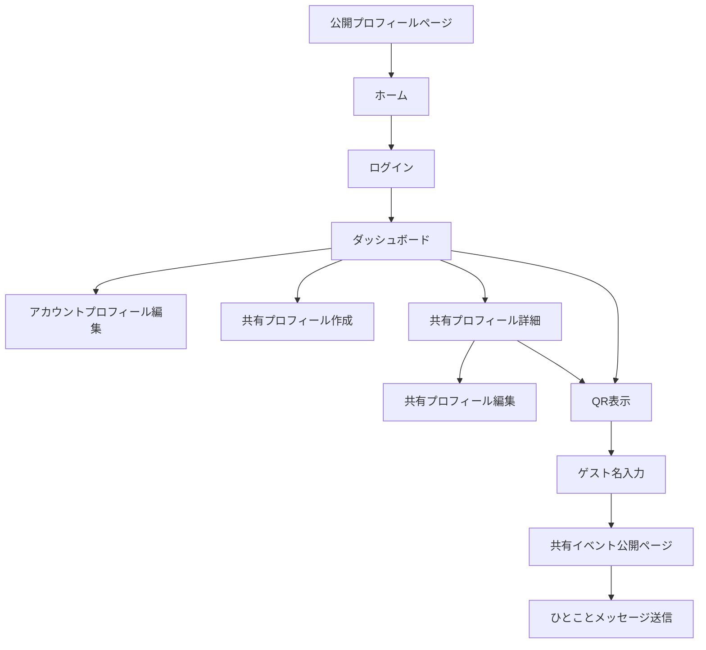
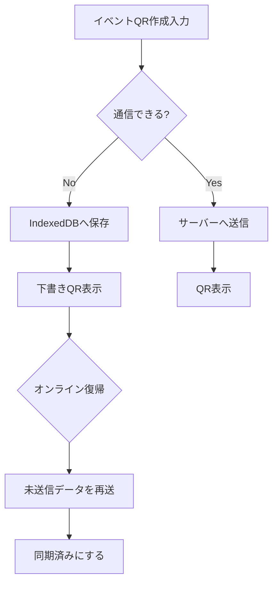

# 1G1A Site Map and Screen Structure

このドキュメントは、1G1A の画面構成、主要導線、各画面の表示項目を整理するための設計メモです。
公開リポジトリに置く前提のため、サーバー固有のホスト名、IP、実ディレクトリ、秘密情報は記載しません。

## 前提

- 現在の実装は PHP + HTML + CSS + JavaScript のフレームワークなし構成。
- PWA/SPA が必要になるのは、通信環境が悪い場所で使う「プロフィール管理」「イベントQR作成」「未送信データの後送信」まわり。
- 既存の公開ページや軽い閲覧画面は、現状の PHP レンダリングでも問題ない。
- 今後の方針として、操作系画面だけを `/app` などに分けて React + TypeScript + Vite 化する選択肢を残す。

## サイトマップ

### 公開・認証前

| URL | 画面名 | 役割 |
| --- | --- | --- |
| `/` | ホーム | サービス入口。未ログインユーザー向けの概要表示。 |
| `/login` | ログイン | Google ログイン、開発用デモログインの入口。 |
| `/auth/google` | Google認証開始 | Google OAuth へ遷移する処理。画面ではなく認証処理。 |
| `/auth/google/callback` | Google認証戻り | Google OAuth の戻り処理。画面ではなく認証処理。 |
| `/logout` | ログアウト | セッションを破棄してホームへ戻す処理。 |
| `/healthz` | ヘルスチェック | サーバー稼働確認用。 |

### ログイン後

| URL | 画面名 | 役割 |
| --- | --- | --- |
| `/dashboard` | ダッシュボード | 共有プロフィール選択、イベントQR作成、最近の共有イベント確認の中心画面。 |
| `/account` | アカウントプロフィール編集 | ユーザー自身の基本表示名・自己紹介を編集する画面。 |
| `/profiles/new` | 共有プロフィール作成 | 相手に見せるプロフィールを新規作成する画面。 |
| `/profiles/{id}` | 共有プロフィール詳細 | 自分が管理する共有プロフィールの内容と最近のイベントを確認する画面。 |
| `/profiles/{id}/edit` | 共有プロフィール編集 | 共有プロフィール、画像、SNSリンク、公開状態を編集する画面。 |
| `/profiles/{id}/qr` | QR表示 | 共有イベントまたは下書きトークンのQRを大きく表示する画面。 |

### ゲスト公開

| URL | 画面名 | 役割 |
| --- | --- | --- |
| `/s/{share_event_token}` | 共有イベント公開ページ | QRを読んだゲストが見る画面。初回は名前入力、2回目以降はイベント・プロフィールを表示。 |
| `/p/{profile_token}` | 公開プロフィールページ | プロフィール単体の公開ページ。共有イベントなしでプロフィールを見る用途。 |
| `/media/{filename}` | メディア配信 | アップロード済み画像を返す。画面ではなく画像配信処理。 |

### 非同期処理・API

| URL | 用途 | 呼び出し元 |
| --- | --- | --- |
| `POST /share-tokens/reserve` | オフラインQR用の共有トークンを事前予約する。 | ダッシュボードのJavaScript。 |
| `POST /share-events/create` | 共有イベントを作成する。JSON応答にも対応。 | ダッシュボード、同期キュー。 |
| `POST /share-events/{id}/location` | QR表示時に取得できた位置情報を保存する。 | QR表示画面のJavaScript。 |

## 画面構成

### ホーム

目的:
サービスの入口。ログイン前のユーザーに、1G1A が「相手に見せるプロフィールとその場のメッセージをQRで渡すサービス」であることを伝える。

表示項目:

- サービス名
- サービス概要
- ログイン導線
- 公開プロフィールのサンプル導線が必要なら追加

主な操作:

- ログイン画面へ進む

### ログイン

目的:
Googleアカウントでログインする。

表示項目:

- Googleログインボタン
- 開発用デモログインボタン
- ログインできない場合の案内

主な操作:

- Google OAuth 開始
- デモログイン

注意:

- デモログインは本番で表示するかどうかを環境設定で制御する。
- メールアドレスやGoogle IDは公開プロフィールには出さない。

### ダッシュボード

目的:
ログイン後の中心画面。会った相手に見せるプロフィールを選び、その場のメッセージや写真を付けてQRを作る。

表示項目:

- 共有プロフィール選択
- 今日のメッセージ
- 写真追加
- QRの有効期限
- QR作成ボタン
- 下書き保存ボタン
- オフライン/未同期状態
- 共有プロフィール一覧
- 最近の共有イベント一覧
- アカウントプロフィール編集導線
- ログアウト導線
- PWAインストール導線

主な操作:

- 共有イベントを作成する
- 通信できない場合はIndexedDBに下書き保存する
- 通信復帰後に未送信データをサーバーへ送る
- 共有プロフィール詳細/編集へ移動する
- 新しい共有プロフィールを作成する

PWA化で強化する項目:

- 未送信件数の表示
- 同期待ち一覧
- 手動再送ボタン
- 同期失敗理由の表示
- 端末内だけに残っている下書きの削除

### アカウントプロフィール編集

目的:
ユーザーアカウントにひもづく基本情報を編集する。共有プロフィールの初期値としても使う。

表示項目:

- 表示名
- 自己紹介
- 保存ボタン
- 公開されない情報の説明

主な操作:

- アカウント表示名を保存する
- アカウント自己紹介を保存する

公開しない項目:

- メールアドレス
- GoogleアカウントID
- 認証情報

### 共有プロフィール作成・編集

目的:
相手に見せるプロフィールを用途別に作る。仕事用、趣味用、イベント用などを分けられるようにする。

表示項目:

- 管理用プロフィール名
- 公開表示名
- プロフィール画像
- 見出し
- 自己紹介
- 公開/非公開
- SNS/外部リンク一覧
- SNS種別
- リンクラベル
- URL
- 保存ボタン

主な操作:

- 共有プロフィールを作成する
- 共有プロフィールを更新する
- プロフィール画像をアップロードする
- SNS/外部リンクを登録・更新する
- 公開状態を切り替える

注意:

- プロフィール画像はURL手入力ではなく、端末からのアップロードを基本にする。
- 公開URLには連番IDを直接出さず、推測されにくい公開トークンを使う。

### 共有プロフィール詳細

目的:
自分が管理する共有プロフィールの内容を確認し、編集やQR表示へ進む。

表示項目:

- 公開表示名
- 見出し
- 自己紹介
- 公開URL
- 公開状態
- SNS/外部リンク一覧
- 最近の共有イベント
- イベント写真

主な操作:

- 編集へ進む
- QR表示へ進む
- 公開URLを確認する

### QR表示

目的:
相手に見せるQRを大きく表示する。通信が不安定でも、相手が画面を写真に撮って後からアクセスできるようにする。

表示項目:

- 共有プロフィール名
- QRコード
- 共有イベントのメッセージ
- 短い説明文
- 英語の補助説明
- URL
- 下書きQRである場合の注意

主な操作:

- 位置情報の取得許可を求める
- 取得できた位置情報を保存する
- QRを相手に見せる
- URLを開く

注意:

- 位置情報は公開ページには表示しない。
- 位置情報取得に失敗してもQR表示は止めない。
- QRは通信復帰を待たずに表示できることを優先する。

### 共有イベント公開ページ

目的:
QRを読んだゲストが、共有されたイベント内容とプロフィールを見る。

初回アクセス時の表示項目:

- 相手の表示名
- ニックネーム入力欄
- 次へボタン

2回目以降、または名前登録後の表示項目:

- ゲストへの歓迎表示
- イベントメッセージ
- イベント写真
- プロフィール画像
- 公開表示名
- 見出し
- 自己紹介
- SNS/外部リンク
- ひとことメッセージ入力欄
- 送信ボタン
- サービス導線

主な操作:

- ゲスト名を登録する
- イベント内容を見る
- SNS/外部リンクを開く
- ひとことメッセージを送る

注意:

- ゲストにログインは求めない。
- ゲスト名は相手を厳密に特定する情報ではなく、閲覧体験を軽くするための表示名として扱う。
- 期限切れの共有イベントは期限切れ画面を表示する。
- まだサーバー同期されていないトークンは準備中画面を表示する。

### 公開プロフィールページ

目的:
共有イベントに依存せず、プロフィール単体を公開する。

表示項目:

- 公開表示名
- 見出し
- 自己紹介
- SNS/外部リンク
- 最近の共有イベント
- ログイン導線

主な操作:

- SNS/外部リンクを開く
- サービスへ戻る

注意:

- 編集ボタンや管理画面リンクは表示しない。
- メールアドレス、Google ID、位置情報は表示しない。

### 準備中ページ

目的:
オフラインで作成されたQRにゲストが先にアクセスした場合、まだ共有イベントがサーバーにないことを伝える。

表示項目:

- 準備中メッセージ
- 後で再アクセスする案内

主な操作:

- 再読み込み
- 時間を置いて再アクセス

注意:

- トークンそのものを画面に出す必要は基本的にない。
- 実装都合で表示する場合も、利用者向けには隠す方向が望ましい。

### 期限切れページ

目的:
有効期限を過ぎた共有イベントにアクセスした場合の案内を表示する。

表示項目:

- 期限切れメッセージ
- サービスへの導線

主な操作:

- ホームへ戻る

## PWA/SPA として追加したい画面

### オフライン同期状態

想定URL:
`/app/sync` またはダッシュボード内のパネル

表示項目:

- 未送信件数
- 同期中件数
- 同期失敗件数
- 下書き作成日時
- 対象プロフィール
- メッセージの先頭
- 写真枚数
- 再送ボタン
- 削除ボタン

必要な内部データ:

- client_request_id
- public_token
- profile_id
- body
- photos
- location
- created_at
- retry_count
- last_error
- sync_status

### イベントQR作成SPA

想定URL:
`/app/events/new`

目的:
通信環境が悪い場所でも、入力、写真追加、QR表示、後送信までを1つのアプリ画面で完結させる。

表示項目:

- プロフィール選択
- メッセージ
- 写真追加
- 有効期限
- 現在の通信状態
- 予約済みトークン状態
- QRプレビュー
- 作成/保存ボタン

必要な機能:

- IndexedDB保存
- オンライン復帰時の再送
- 送信済み判定
- 二重送信防止
- Service Worker キャッシュ

### プロフィール編集SPA

想定URL:
`/app/profiles`

目的:
スマホでのプロフィール編集、画像アップロード、SNSリンク編集を操作しやすくする。

表示項目:

- プロフィール一覧
- 編集フォーム
- 画像アップロード
- SNSリンク編集
- 公開状態
- 保存状態

必要な機能:

- 入力途中の端末内保存
- 保存失敗時の再送
- 画像アップロードの進捗表示
- バリデーション

## 主要データと画面の対応

| データ | 主な画面 | 用途 |
| --- | --- | --- |
| `users` | ログイン、アカウント編集 | 認証ユーザーと基本表示情報。 |
| `profiles` | ダッシュボード、プロフィール作成/編集/詳細、公開ページ | 相手に見せる共有プロフィール。 |
| `profile_sns` | プロフィール編集、公開ページ、共有イベント公開ページ | SNS/外部リンク。 |
| `share_events` | ダッシュボード、QR表示、共有イベント公開ページ | その場で作った共有イベント。 |
| `share_event_photos` | ダッシュボード、共有イベント公開ページ | 共有イベントに添付した写真。 |
| `reserved_share_tokens` | ダッシュボード、QR表示、同期処理 | オフラインQR用の事前予約トークン。 |
| `guest_visitors` | 共有イベント公開ページ | ゲスト名と閲覧Cookieの対応。 |
| `guest_messages` | 共有イベント公開ページ | ゲストから所有者へのひとことメッセージ。 |
| `share_access_logs` | 管理・分析予定 | 共有イベント閲覧ログ。 |

## 画面導線

## オフライン同期導線

## 次に決めること

- PWA/SPA領域のURLを `/app` にするか、既存画面の中に段階的に組み込むか。
- QR作成画面をダッシュボード内に残すか、専用画面に分けるか。
- `client_request_id` をDBに追加して二重送信防止を強化するか。
- 未送信データの保存期間と削除ルール。
- ゲストのひとことメッセージをメール通知だけにするか、管理画面にも一覧表示するか。
- 共有イベントの有効期限切れ後に、所有者だけが内容を見られるようにするか。
- プロフィール画像とイベント写真の最大サイズ、圧縮方針、保存先。
