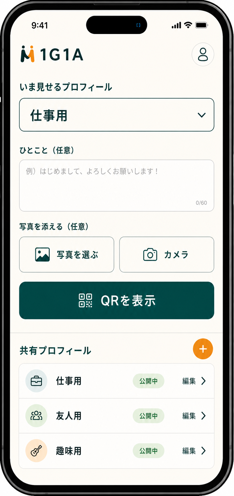
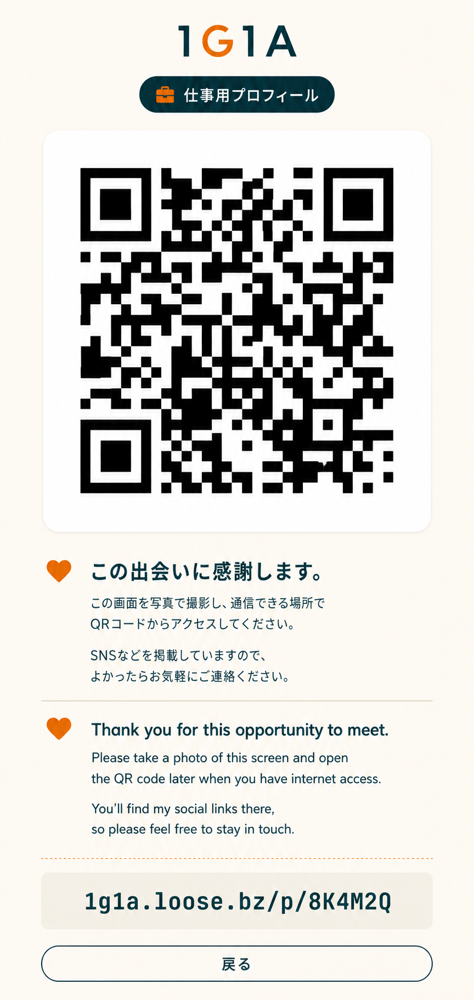
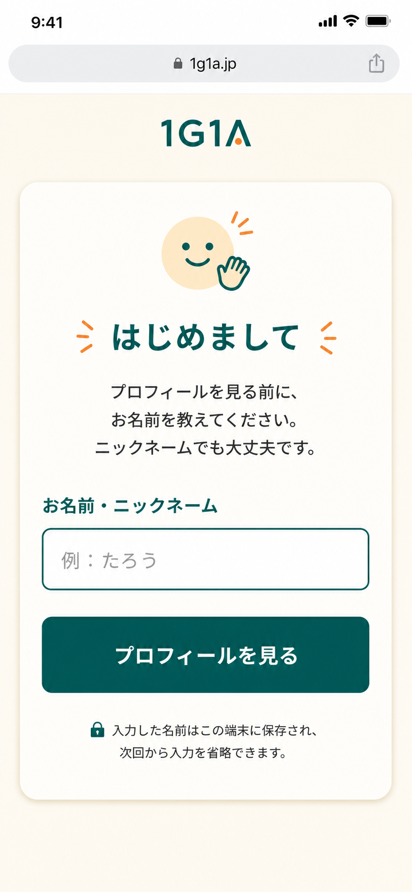
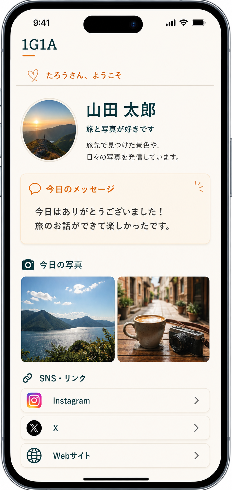

# 1G1A スマートフォン UI イメージ

1G1A は、ユーザーが人と会ったその場で「相手に見せたい共有プロフィール」を選び、QR で渡すためのサービスです。スマホ利用が中心なので、管理画面もゲスト画面も操作数を少なくし、画面ごとの目的をはっきり分けます。

## ユーザー管理トップ

ログイン後、ユーザーが最初に開く画面です。

- まず「共有プロフィールを選ぶ」ことを最優先にする
- 次に「一言と写真を足す」
- 最後に大きな `QR を公開` ボタンを押す
- 表示させたい共有プロフィールをプルダウンで選ぶ
- 必要なら今回だけのコメントを追加する
- 必要なら写真を追加する。スマホではカメラ起動も想定する
- `QRを公開` で QR 表示画面へ進む
- 共有プロフィールはリスト形式で管理し、`+` から追加できる



## QR 表示画面

相手にその場で見せる画面です。QR を直接読み取れない場合や、ネットワークが不安定な場所でも、画面を写真で撮ってあとからアクセスできることを前提にします。

- QR は撮影しやすい大きさと高いコントラストで表示する
- 日本語と英語で、写真に残してあとからアクセスできることを説明する
- 短い URL も表示する
- QR 表示時にブラウザの位置情報許可を求め、許可された場合は緯度・経度・精度を保存する
- 位置情報の保存に失敗しても QR 表示は止めない
- 位置情報は管理者本人だけが確認でき、公開ページやゲスト画面には出さない

表示メッセージ案:

```text
この出会いに感謝。
このQRを写真で撮っておくと、あとからSNSなどの連絡先を確認できます。

Thank you for this encounter.
Please take a photo of this QR code so you can visit my profile later.

QR 画面には戻るボタンや詳細ボタンは置かず、見せることに集中する。
```



## ゲスト初回名前入力画面

ゲストが QR から初めてアクセスしたときの画面です。Cookie を確認し、未登録なら名前またはニックネームを入力してもらいます。

- 入力項目はニックネームのみ
- ボタンは `次へ` だけにする
- 初回以外は入力画面を出さず、保存済みの名前でプロフィール画面へ進む
- ログインは要求しない
- ゲスト名は相手を特定しすぎないよう、自由なニックネームでもよい



## ゲスト公開プロフィール画面

ゲストが名前入力後、または2回目以降に見る画面です。編集ボタンや管理リンクは表示せず、共有されたプロフィール・今回のメッセージ・写真・SNS リンクだけを見せます。

- 冒頭に `○○さん、ようこそ` と表示する
- 共有プロフィールの名前、見出し、紹介文を表示する
- 今回だけのコメントは `今日のメッセージ` として目立たせる
- 今回追加した写真は `今日の写真` として表示する
- SNS や Web サイトへのリンクは大きなタップ領域にする
- ゲスト画面には QR、プロフィール選択、設定、ログイン導線を置かない


